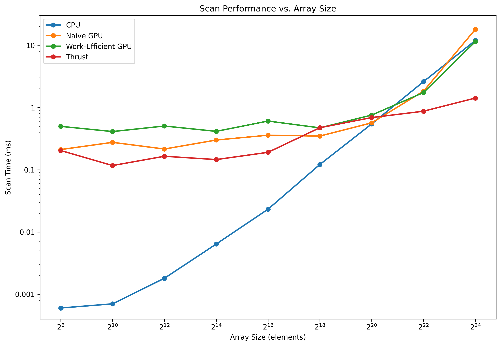
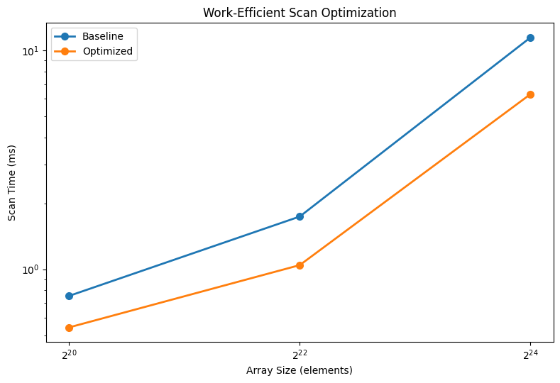
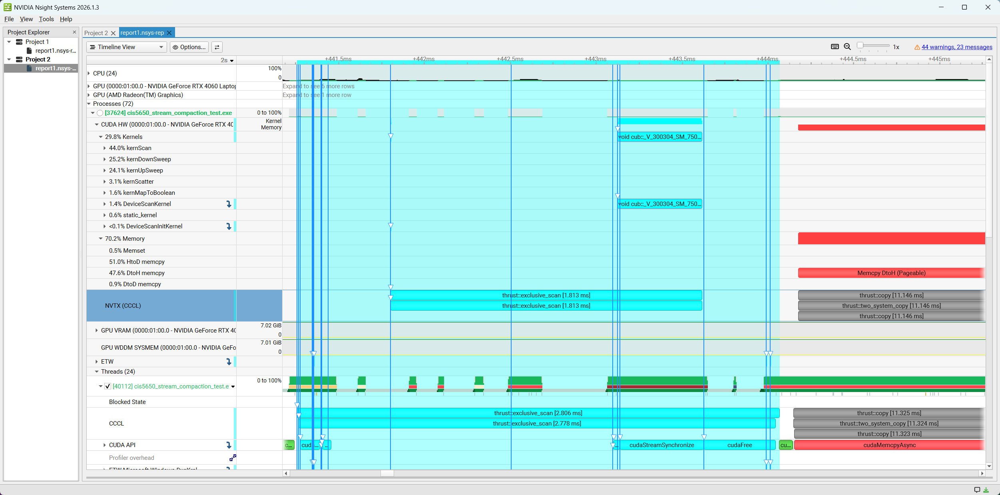

CUDA Stream Compaction
======================

**University of Pennsylvania, CIS 565: GPU Programming and Architecture, Project 2**

* Zi Yang
  * [LinkedIn](https://www.linkedin.com/in/zi-yang-3359653b2/)
* Tested on: Windows 11, AMD Ryzen 9 7845HX, 15 GB RAM, NVIDIA GeForce RTX 4060 Laptop GPU (8 GB VRAM), Personal Computer

## Project Overview

This project implements and compares several scan and stream compaction algorithms on the CPU and GPU.

### Features

- Serial CPU exclusive scan
- CPU stream compaction with and without scan
- Naive CUDA scan
- Work-efficient CUDA scan
- GPU stream compaction using map, scan, and scatter
- Thrust exclusive scan
- Optimized work-efficient scan with level-dependent thread counts 

## Performance Analysis

All tests were run in Release mode without debugging. Initial and final GPU memory operations were excluded from the measured time.

I tested several block sizes and used 128 threads per block for the naive scan and 512 threads per block for the work-efficient scan. Each result is the median of ten runs.

### Scan Performance

| Array Size | CPU (ms) | Naive GPU (ms) | Work-Efficient GPU (ms) | Thrust (ms) |
|---:|---:|---:|---:|---:|
| 256 | 0.000600 | 0.210944 | 0.497664 | 0.203520 |
| 1,024 | 0.000700 | 0.275456 | 0.410624 | 0.116736 |
| 4,096 | 0.001800 | 0.215104 | 0.503808 | 0.164608 |
| 16,384 | 0.006400 | 0.300032 | 0.413696 | 0.145600 |
| 65,536 | 0.023200 | 0.358720 | 0.605760 | 0.190464 |
| 262,144 | 0.121400 | 0.347424 | 0.470816 | 0.473088 |
| 1,048,576 | 0.544500 | 0.566560 | 0.754912 | 0.689152 |
| 4,194,304 | 2.603000 | 1.828510 | 1.739360 | 0.871360 |
| 16,777,216 | 11.936500 | 18.015400 | 11.432400 | 1.417180 |



### Analysis

For small arrays, the CPU scan is much faster because the GPU work is too small to offset kernel launch overhead. As the array size increases, GPU parallelism becomes more useful. Around `2^22` elements, the GPU implementations begin to outperform the CPU.

The naive scan scales poorly for large inputs because it performs `O(nlogn)` work and launches one kernel for each scan step.

The work-efficient scan reduces the total work to `O(n)`, but the baseline version still launches a kernel for every up-sweep and down-sweep level. At deeper levels, only a small fraction of the launched threads do useful work.

Thrust scales the best for large inputs and is much faster than the other implementations at `2^24` elements.

## Extra Credit: Work-Efficient Scan Optimization

The baseline work-efficient scan launched the same number of blocks at every up-sweep and down-sweep level. Near the root of the tree, most of these threads were inactive.

I changed the launch size at each level based on the number of active nodes:

```cpp
int activeThreads = paddedSize >> (d + 1);
int blocks = (activeThreads + blockSize - 1) / blockSize;
```

This keeps the same scan algorithm while avoiding unnecessary thread and block launches.

### Performance

| Array Size | Baseline (ms) | Optimized (ms) | Speedup |
|---:|---:|---:|---:|
| `2^20` | 0.754912 | 0.542112 | 1.39x |
| `2^22` | 1.739360 | 1.043900 | 1.67x |
| `2^24` | 11.432400 | 6.299780 | 1.81x |



The optimization becomes more effective as the input grows. At `2^24` elements, the optimized version is about 1.81x faster than the baseline.

## Thrust Analysis

Nsight Systems shows that Thrust uses far fewer scan kernel launches than my implementations. The naive scan launches one `kernScan` kernel per step, while the work-efficient scan launches one kernel for every up-sweep and down-sweep level. Thrust performs most of the scan using a small number of `DeviceScan` kernels.

The timeline also shows HtoD and DtoH copies before and after the scan. These copies are outside the measured scan time.



## Test Output

```text
****************
** SCAN TESTS **
****************
    [   1  26  41  48   0  31  43  20  49  44   7  11   5 ...   1   0 ]
==== cpu scan, power-of-two ====
   elapsed time: 0.6362ms    (std::chrono Measured)
    [   0   1  27  68 116 116 147 190 210 259 303 310 321 ... 25666234 25666235 ]
==== cpu scan, non-power-of-two ====
   elapsed time: 0.7617ms    (std::chrono Measured)
    [   0   1  27  68 116 116 147 190 210 259 303 310 321 ... 25666165 25666197 ]
    passed
==== naive scan, power-of-two ====
   elapsed time: 0.633632ms    (CUDA Measured)
    passed
==== naive scan, non-power-of-two ====
   elapsed time: 0.329344ms    (CUDA Measured)
    passed
==== work-efficient scan, power-of-two ====
   elapsed time: 0.511776ms    (CUDA Measured)
    passed
==== work-efficient scan, non-power-of-two ====
   elapsed time: 0.4016ms    (CUDA Measured)
    passed
==== thrust scan, power-of-two ====
   elapsed time: 0.68544ms    (CUDA Measured)
    passed
==== thrust scan, non-power-of-two ====
   elapsed time: 0.571584ms    (CUDA Measured)
    passed

*****************************
** STREAM COMPACTION TESTS **
*****************************
    [   3   3   0   3   1   0   0   2   2   0   3   1   0 ...   2   0 ]
==== cpu compact without scan, power-of-two ====
   elapsed time: 1.5571ms    (std::chrono Measured)
    [   3   3   3   1   2   2   3   1   1   2   2   2   1 ...   3   2 ]
    passed
==== cpu compact without scan, non-power-of-two ====
   elapsed time: 1.4856ms    (std::chrono Measured)
    [   3   3   3   1   2   2   3   1   1   2   2   2   1 ...   2   2 ]
    passed
==== cpu compact with scan ====
   elapsed time: 1.6456ms    (std::chrono Measured)
    [   3   3   3   1   2   2   3   1   1   2   2   2   1 ...   3   2 ]
    passed
==== work-efficient compact, power-of-two ====
   elapsed time: 1.06701ms    (CUDA Measured)
    passed
==== work-efficient compact, non-power-of-two ====
   elapsed time: 0.904928ms    (CUDA Measured)
    passed
```